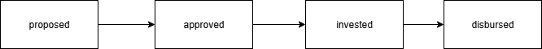
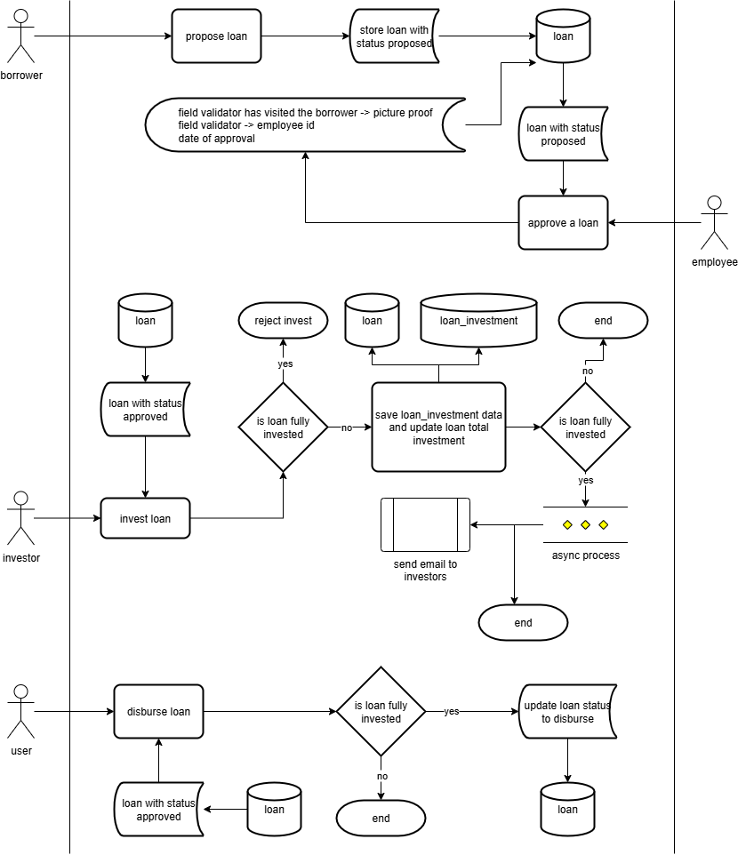
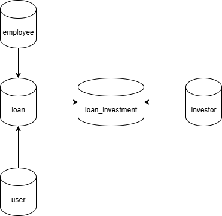

# Amartha Test Interview

Golang service for managing loans, generating agreement letters (PDF), and notifying investors when a loan is fully funded.

## Table of Contents
- [Architecture & Diagrams](#architecture--diagrams)
- [Prerequisites](#prerequisites)
- [Installation](#installation)
- [Project Structure](#project-structure)
- [Running the Application](#running-the-application)
- [Development](#development)
- [Testing](#testing)
- [License](#license)

## Architecture & Diagrams
- **Loan State Machine**: status lifecycle.  
  

- **Service Flowchart**: high-level request flow, async processing.  
  

- **Database Schema**: tables, relations.  
  

## Prerequisites

- [Go](https://golang.org/dl/) 1.24 or higher
- [Visual Studio Code](https://code.visualstudio.com/) with [Go extension](https://marketplace.visualstudio.com/items?itemName=golang.go)

## Installation

1. Clone the repository:
   ```bash
   git clone https://github.com/adityaokke/test-amartha.git
   cd test-amartha
   ```
2. Modify SMTP_PASS on .env file by using pass i give on email
   ```env
   SMPT_PASS=brevo-smptp-password-i-mention-on-email
   ```

## Project Structure

```
.
├── .vscode/                           # VS Code configuration
├── cmd/                               # Main applications
│   └── test-amartha/                  # Server entry point
├── internal/                          # Private application code
│   ├── delivery/                      # Delivery/Handler layer (HTTP handlers)
│   ├── entity/                        # Domain entities/models
│   ├── pkg/                           # Internal packages
│   ├── repository/                    # Data access layer
│   ├── storage/                       # Storage layer (local file storage)
│   └── service/                       # Business logic layer
├── api/                               # API definitions (Postman specs)
├── go.mod                             # Go module definition
├── go.sum                             # Go dependencies checksums
└── README.md                          # Project documentation
```

## Running the Application

### Using VS Code Debugger

1. Open the project in VS Code
2. Open the Debug panel (Ctrl+Shift+D or Cmd+Shift+D on Mac)
3. Select **"Launch Package"** from the dropdown
4. Press F5 or click the green play button to start debugging

The debugger will:
- Build the application
- Start the application with debugging enabled
- Allow you to set breakpoints and inspect variables
- Automatically attach to the running process

### Using Command Line

Run the application directly:
```bash
go run cmd/test-amartha/main.go
```

Or build and run:
```bash
go build -o bin/server cmd/test-amartha/main.go
./bin/server
```


## Development

### VS Code Debug Configuration

The project includes a `.vscode/launch.json` configuration for debugging. The **"Launch Package"** configuration allows you to:

- Debug the current package or file
- Set breakpoints in your code
- Inspect variables and stack traces
- Step through code execution

Example `.vscode/launch.json`:
```json
{
    "version": "0.2.0",
    "configurations": [
        {
            "name": "Launch Package",
            "type": "go",
            "request": "launch",
            "mode": "debug",
            "program": "${workspaceFolder}/cmd/test-amartha",
            "cwd": "${workspaceFolder}", 
            "output": "${workspaceFolder}/debug",
        }
    ]
}
```

### Adding Breakpoints

1. Click on the left margin next to a line number in VS Code
2. A red dot will appear indicating a breakpoint
3. Run the debugger using "Launch Package"
4. Execution will pause at your breakpoints

## Testing

Run all tests:
```bash
go test ./...
```

Run tests with coverage:
```bash
go test -cover ./...
```

Run tests with detailed coverage report:
```bash
go test -coverprofile=coverage.out ./...
go tool cover -html=coverage.out
```

Run specific package tests:
```bash
go test ./internal/service/...
```

## Troubleshooting

### Debugger Not Working

1. Ensure the Go extension is installed in VS Code
2. Check that `dlv` (Delve debugger) is installed:
   ```bash
   go install github.com/go-delve/delve/cmd/dlv@latest
   ```
3. Verify your `launch.json` configuration is correct
4. Try reloading VS Code window (Ctrl+Shift+P → "Developer: Reload Window")

### Import Errors

```bash
go mod tidy
go mod download
```

## License

This project is licensed under the MIT License - see the [LICENSE](https://opensource.org/license/mit) file for details.

## Contact

Aditya Okke Sugiarso - adityaokke@gmail.com

Project Link: [https://github.com/adityaokke/test-amartha](https://github.com/adityaokke/test-amartha)
